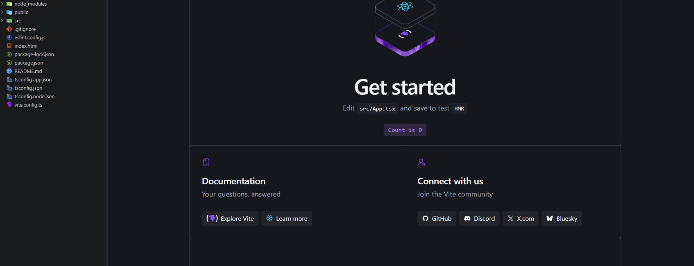
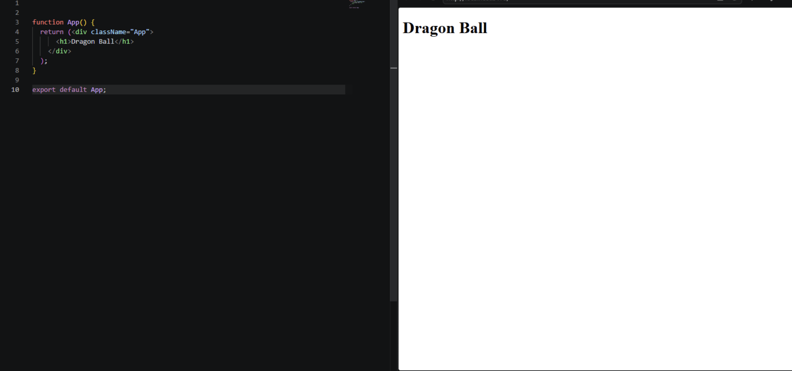
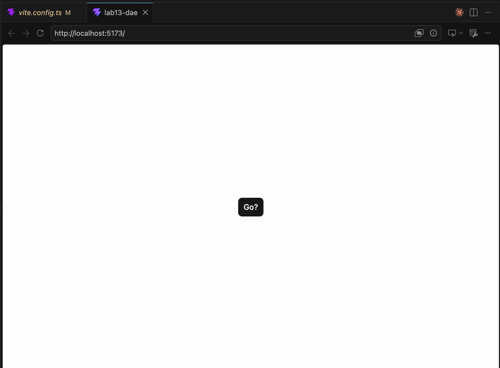
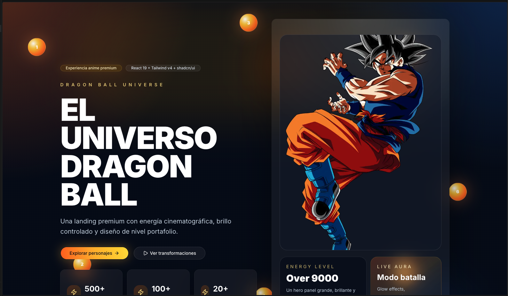

# 🐉 Dragon Ball Premium Landing

Proyecto desarrollado para el curso de **Desarrollo de Aplicaciones Empresariales (DAE)** utilizando **React 19**, **Vite**, **TypeScript**, **Tailwind CSS v4** y **shadcn/ui**.

El objetivo fue construir una landing page moderna inspirada en el universo de Dragon Ball, aplicando buenas prácticas de desarrollo frontend, diseño responsivo y componentización.

---

# 📸 Evidencias del Desarrollo

## 1️⃣ Proyecto Vite Inicial

Creación del proyecto base utilizando React + Vite + TypeScript.



---

## 2️⃣ Código Base React

Implementación inicial de la aplicación y configuración de la estructura principal del proyecto.



---

## 3️⃣ Integración de shadcn/ui

Configuración e implementación de componentes modernos utilizando la librería shadcn/ui.



---

## 4️⃣ Landing Page Premium Final

Resultado final del proyecto con diseño moderno inspirado en Dragon Ball, utilizando componentes reutilizables, efectos visuales y una interfaz atractiva.



---

# 🛠️ Tecnologías Utilizadas

| Tecnología | Versión |
|------------|----------|
| React | 19 |
| Vite | 8 |
| TypeScript | 6 |
| Tailwind CSS | 4 |
| shadcn/ui | 4 |
| ESLint | 10 |

---

# 🚀 Instalación

### Clonar repositorio

```bash
git clone https://github.com/JasonGomezzz/lab13-DAE.git
```

### Ingresar al proyecto

```bash
cd lab13-DAE
```

### Instalar dependencias

```bash
npm install
```

### Ejecutar proyecto

```bash
npm run dev
```

---

# 📁 Estructura del Proyecto

```text
src/
├── components/
│   ├── ui/
│   │   ├── button.tsx
│   │   ├── card.tsx
│   │   ├── badge.tsx
│   │   ├── avatar.tsx
│   │   ├── tabs.tsx
│   │   └── otros componentes shadcn
│
│   ├── Navbar.tsx
│   ├── Hero.tsx
│   ├── Characters.tsx
│   ├── DragonBalls.tsx
│   ├── Transformations.tsx
│   ├── Timeline.tsx
│   ├── Gallery.tsx
│   ├── Stats.tsx
│   ├── CTA.tsx
│   └── Footer.tsx
│
├── lib/
│   ├── utils.ts
│   ├── dbz.ts
│   └── dragonball.ts
│
├── App.tsx
└── main.tsx
```

---

# ✨ Funcionalidades Implementadas

- Configuración de React + Vite + TypeScript.
- Integración de Tailwind CSS v4.
- Implementación de componentes shadcn/ui.
- Diseño responsivo.
- Landing page temática de Dragon Ball.
- Componentización reutilizable.
- Buenas prácticas de desarrollo frontend.
- Estructura escalable para futuros módulos.

---

# 👨‍💻 Autor

**Jason Gomez**

Desarrollo de Aplicaciones Empresariales (DAE)

Tecsup - 2026