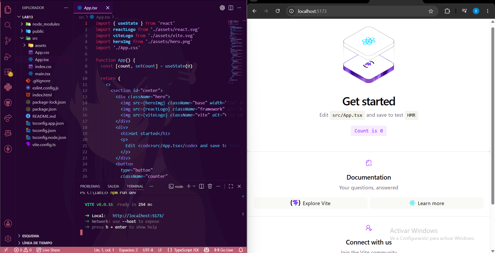
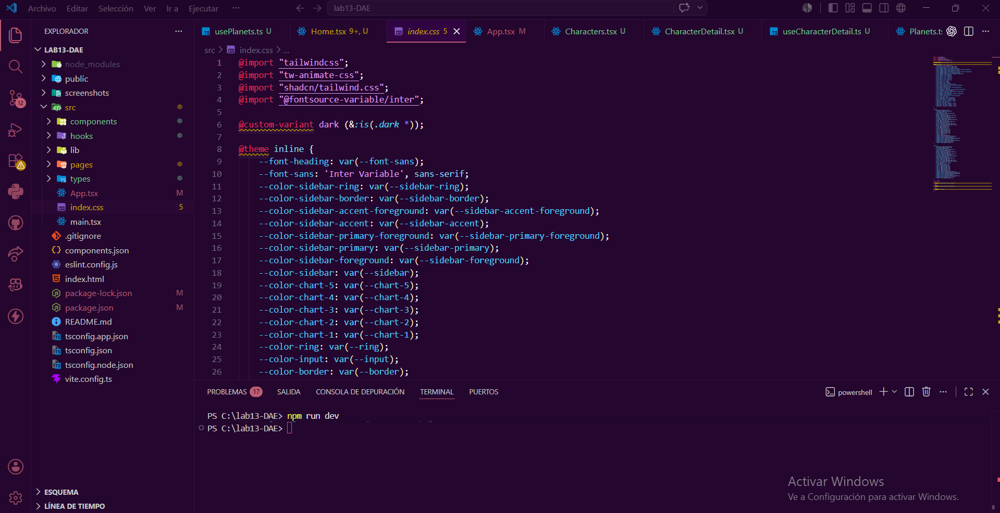
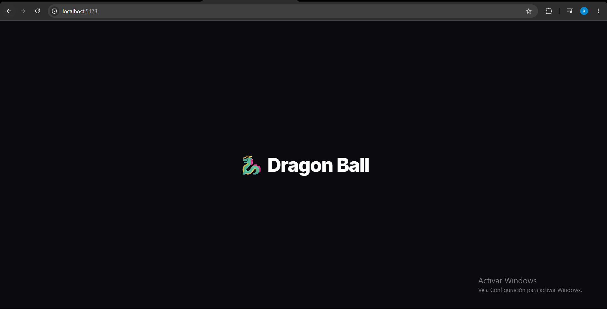
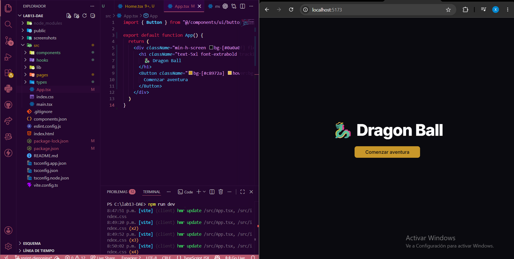
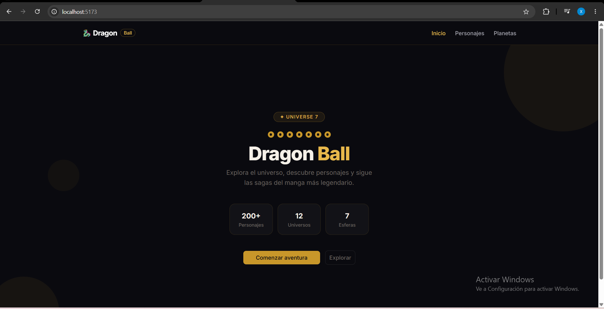

# 🐉 Dragon Ball

> App web construida con React 19 + Vite + TypeScript + shadcn/ui que consume la API pública de Dragon Ball.

---

## 📸 Documentación visual

### 1. Proyecto Vite predeterminado


### 2. Configuración de Tailwind


### 3. Diseño minimalista


### 4. Título + Button de shadcn


### 5. Proyecto rediseñado


---

## 🛠️ Tech Stack

| Tecnología | Versión |
|---|---|
| React + React Compiler | 19 / 1.0.0 |
| Vite | 8 |
| TypeScript | 6 |
| React Router | 7 |
| shadcn/ui | 4 |
| Tailwind CSS | 4 |

---

## 🚀 Getting Started

```bash
git clone https://github.com/JasonGomezzz/lab13-DAE.git
cd dragonball
npm install
npm run dev
```

---

## 📁 Project Structure

```
src/
├── components/
│   ├── ui/              # Card, Badge, Button, Tabs... (shadcn)
│   └── NavBar.tsx
├── hooks/
│   ├── useCharacters.ts
│   ├── useCharacterDetail.ts
│   └── usePlanets.ts
├── pages/
│   ├── Home.tsx
│   ├── Characters.tsx
│   ├── CharacterDetail.tsx
│   └── Planets.tsx
├── types/
│   └── dragonball.ts
└── screenshots/
    ├── 01-vite-default.png
    ├── 02-tailwind-import.png
    ├── 03-design-minimal.png
    ├── 04-button-import.png
    └── 05-redesign.png
```

---

## 🌐 API

`https://dragonball-api.com/api`

| Endpoint | Descripción |
|---|---|
| `GET /characters?limit=12&page=1` | Listado paginado de personajes |
| `GET /characters/:id` | Detalle + transformaciones |
| `GET /planets?limit=12&page=1` | Listado paginado de planetas |

---

## 🗺️ Routes

| Path | Descripción |
|---|---|
| `/` | Onboarding de bienvenida |
| `/characters` | Grid de personajes con paginación |
| `/characters/:id` | Detalle + transformaciones |
| `/planets` | Grid de planetas con paginación |

---

## 👤 Autor

**Diego Nina**  
Tecsup — Desarrollo de Aplicaciones Web